# kottans-frontend
#### My progress in kottans course:
- [Git Basics](#git)
- [Linux CLI, and HTTP](#linux_http)
- [Git Collaboration](#git_collaboration)
- [Intro to HTML and CSS](#html_scc)

## <a name="git">1. Git Basics</a>
I already knew a little about git. The [Udacity course](https://www.udacity.com/course/version-control-with-git--ud123) was very interesting, I learned about such commands as: `diff`, `reset`, `fetch`, `rebase`, `cherry-pick`. And the tasks in [learngitbranching.js.org](https://learngitbranching.js.org/) helped a lot to get into working with branches. I learned this topic with pleasure, but I will still come back to it to refresh my knowledge of git.

I keep to myself [Udacity Git Commit Message Style Guide](https://udacity.github.io/git-styleguide/).

Udacity course is done (<b>screenshots</b>)

  
  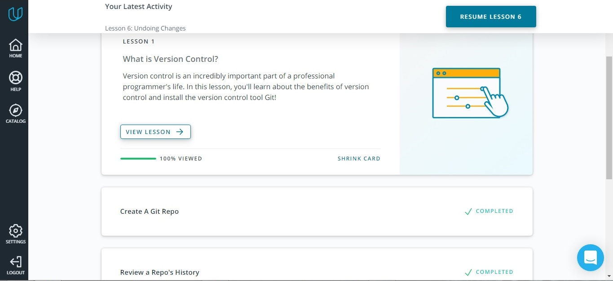  
  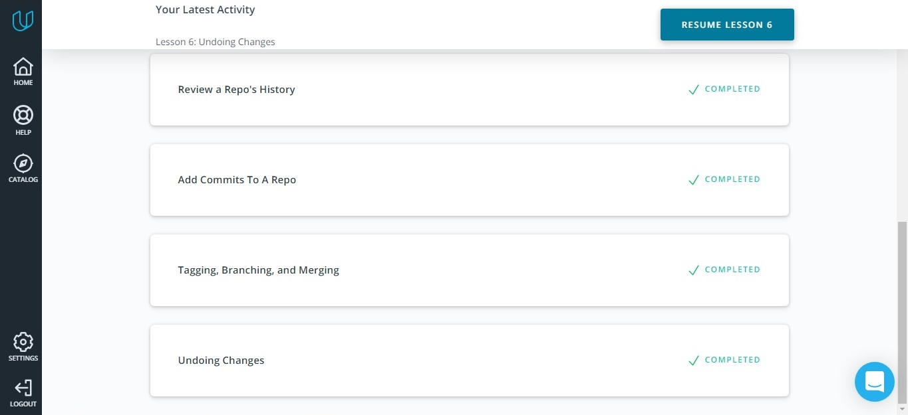  

The tasks on learngitbranching.js.org are done (<b>screenshots</b>)

  
  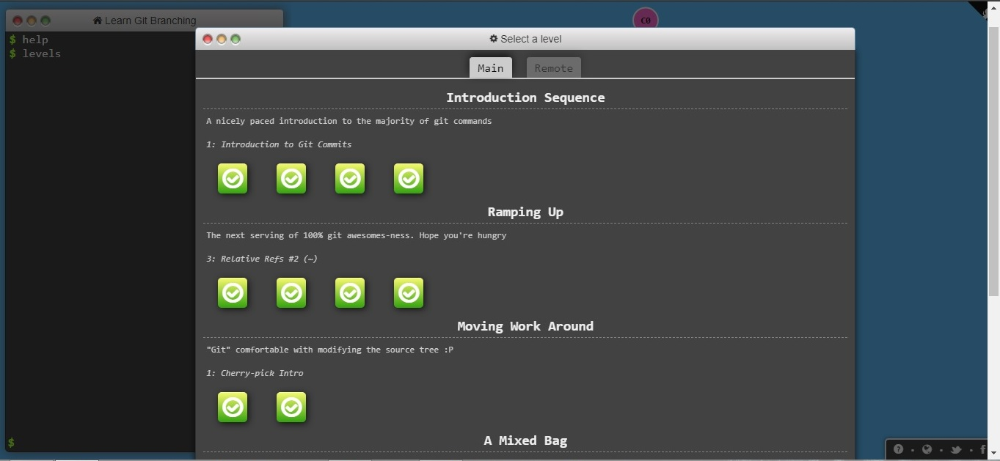  
  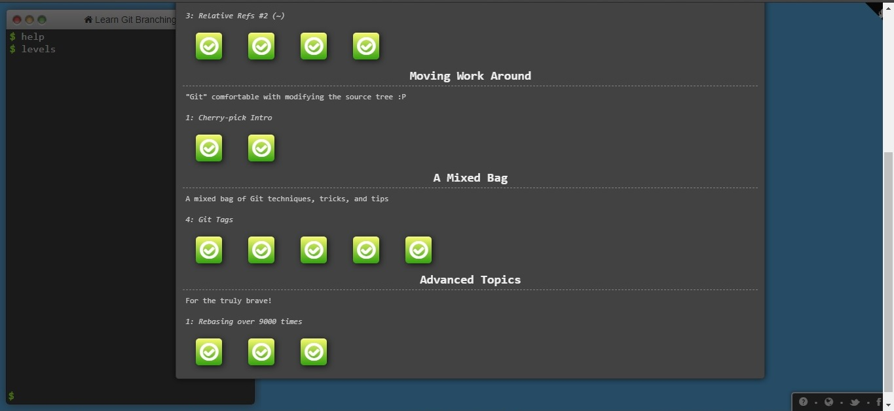  
  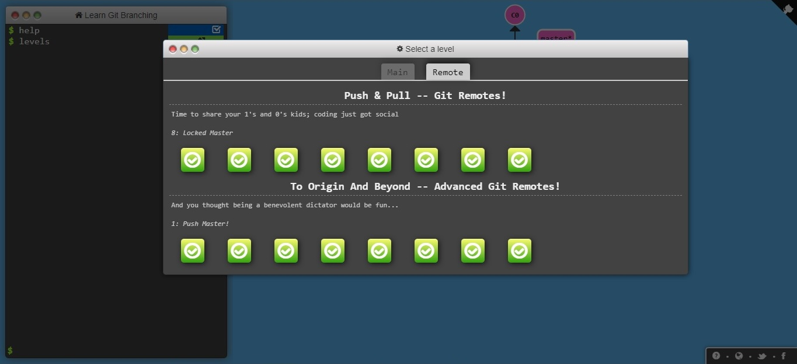 

## <a name="linux_http">2. Linux CLI, and HTTP</a>

### Linux CLI
I really liked [Linux Survival (4 modules)](https://linuxsurvival.com/). The information was interesting and easy to understand. 
To tell you the truth, To tell you the truth, I'm starting to love the command line and Linux OS. Unfortunately, my computer runs on Windows, but it seems to me that I'll switch to Linux in the near future. 
My knowledge in this area was small, but thanks to this course, it began to expand. 
I learned new commands for myself, such as: 
> - `chmod`  change file permission
> - `finger`  view information about users
> - `lpr, lpq, lprm`  Send to Printer to Print and / or Cancel
> - `grep`  search for a word in the text
> - `ps`  see running processes
> - `kill` kill running process
> - `kill -9`  kill immediately running process) 

Linux Survival is done (<b>screenshots</b>)

  
  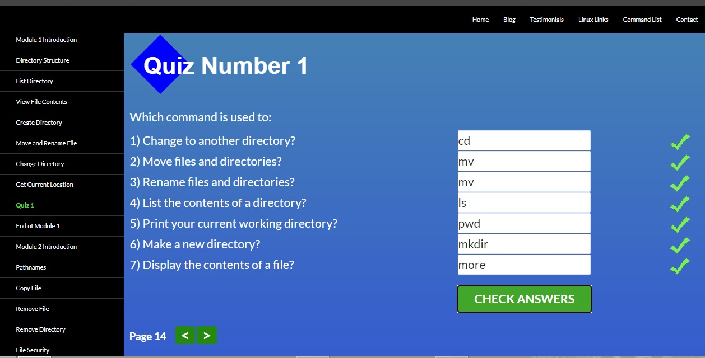  
  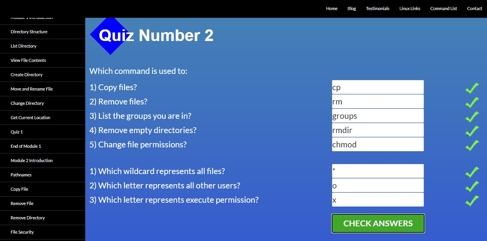  
  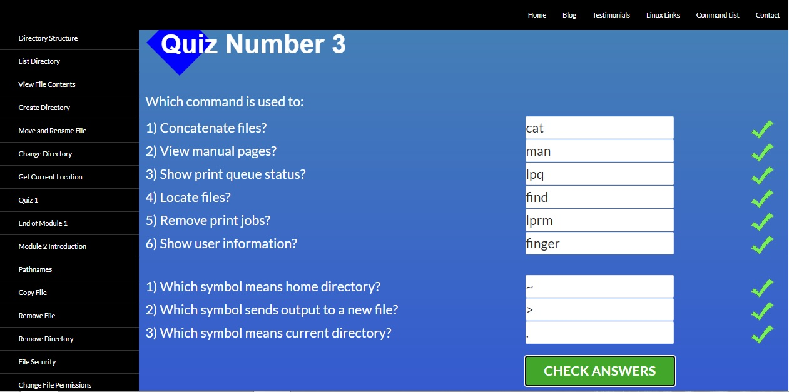  
  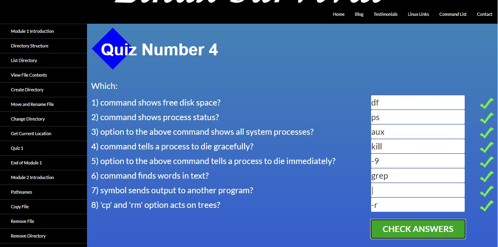  

### HTTP
I also learned the HTTP protocol. Information on this topic isn't easy for me. 
I'll come back to this material later to repeat it. 
HTTP protocol: [part-1](https://code.tutsplus.com/tutorials/http-the-protocol-every-web-developer-must-know-part-1--net-31177), [part-2](https://code.tutsplus.com/tutorials/http-the-protocol-every-web-developer-must-know-part-2--net-31155). 

## <a name="git_collaboration">3. Git Collaboration</a> 
I liked [this topic](https://classroom.udacity.com/courses/ud456) of this course. I learned how collaborate in git with other developers. I also learned to create forks and pull requests. I figured out in more detail the `rebase` and `cherry-pick`. I also repeated what I already knew, which I also find very useful.

Udacity course is done (<b>screenshots</b>)

  
  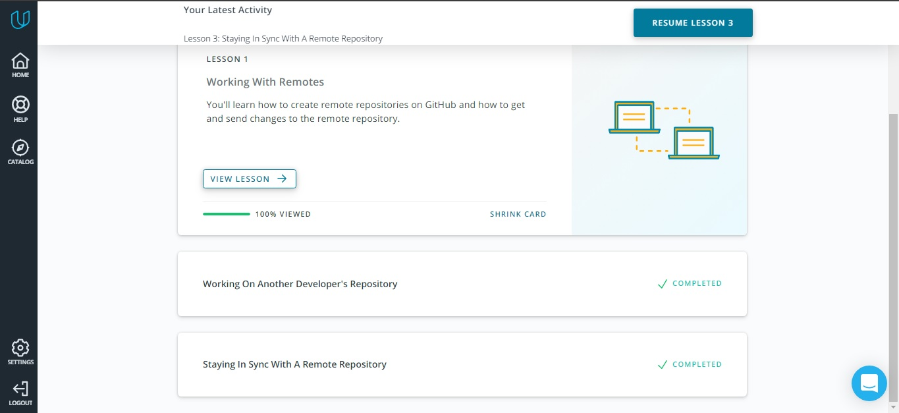 

The tasks on learngitbranching.js.org are done (<b>screenshots</b>)

  
  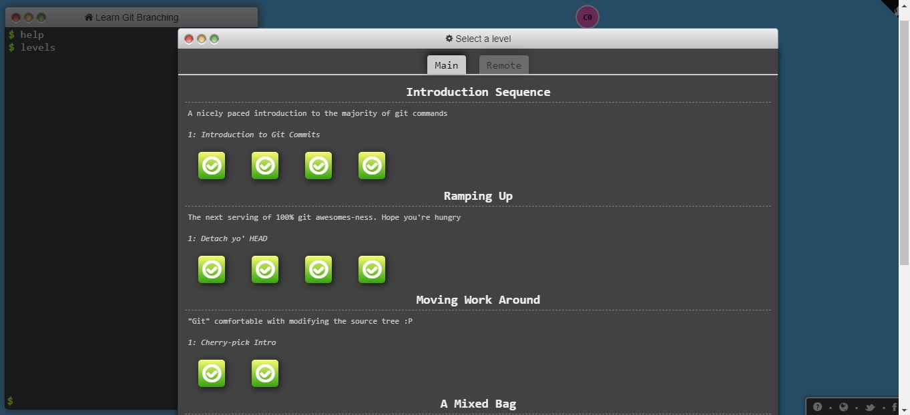  
    

## <a name="html_scc">4. Intro to HTML and CSS</a>
Before learning on this course, I already knew a little HTML and CSS, but after learning at [Udasity](https://www.udacity.com/course/intro-to-html-and-css--ud001) and [Codecademy](https://www.codecademy.com/catalog/language/html-css) I repeated the material, learned in more detail what I didn't understand, and I also learned new things for myself such as CSS Grid.

Intro to HTML & CSS (<b>screenshots</b>)

  
  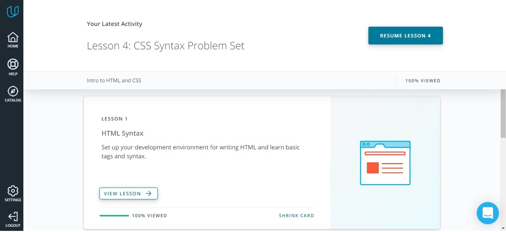  
  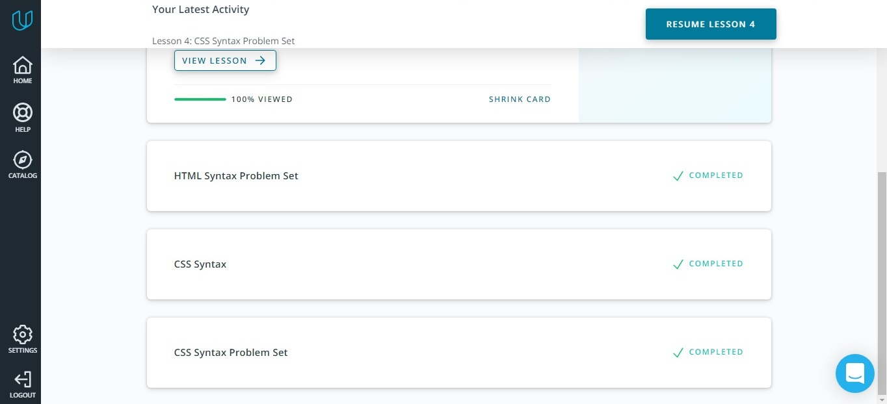 

Learn HTML (<b>screenshots</b>)

  
  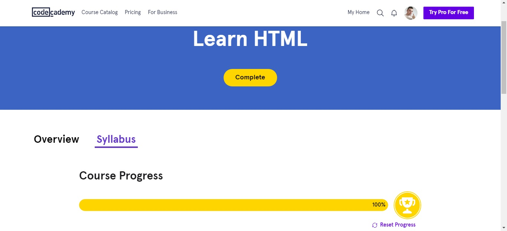  
  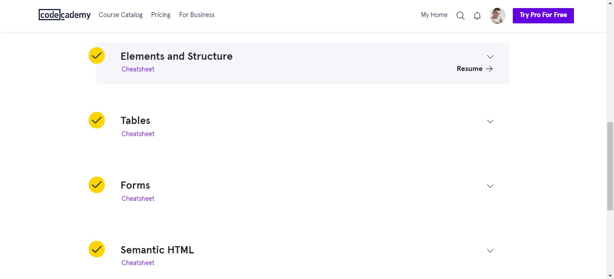  
  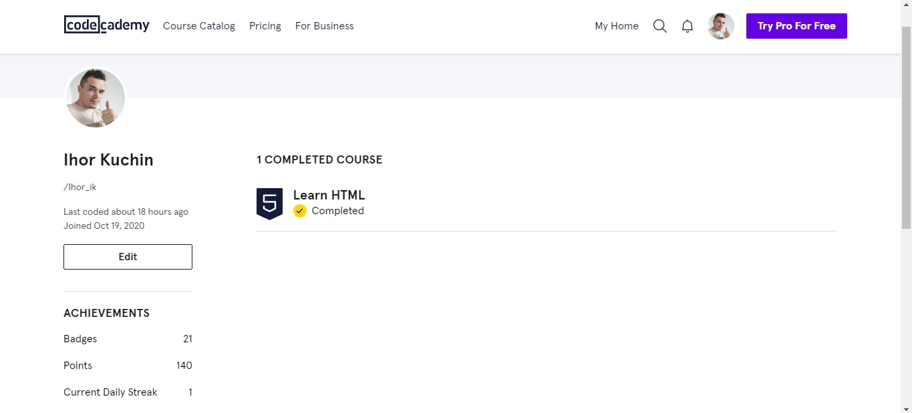 

Learn CSS (<b>screenshots</b>)

  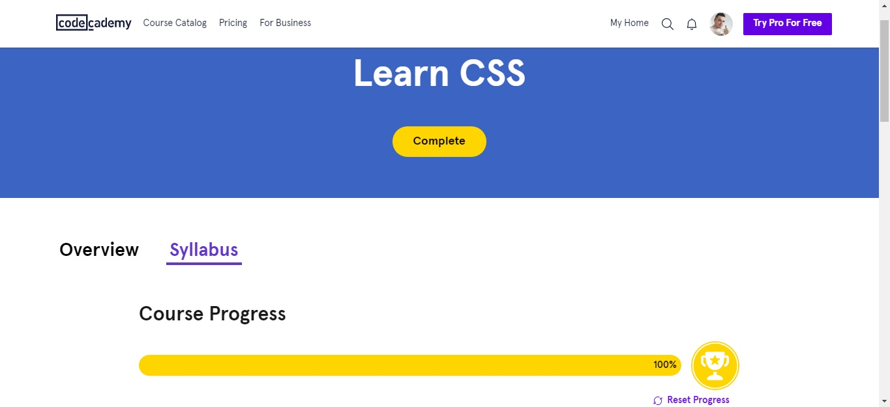  
  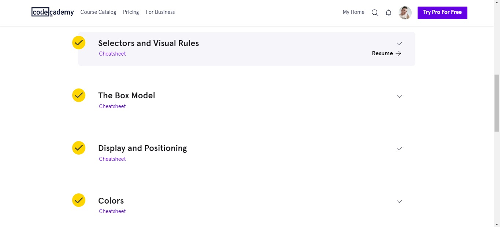  
  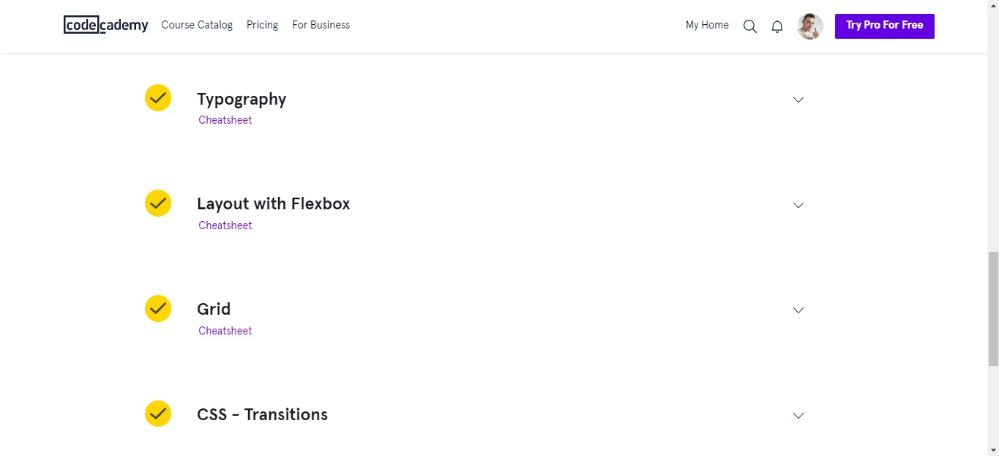  
  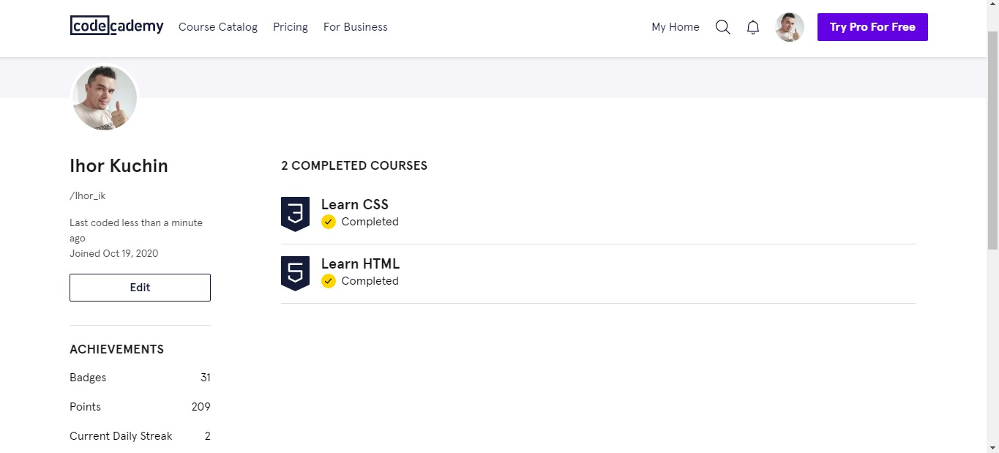 

