# kottans-frontend
#### My progress in kottans course:

**Stage 0**

- [1. Git Basics](#git)
- [2. Linux CLI, and HTTP](#linux_http)
- [3. Git Collaboration](#git_collaboration)
- [4. Intro to HTML and CSS](#html_scc)
- [5. Responsive Web Design](#responsive)
- [6. HTML & CSS Practice](#popup) 
- [7. JavaScript Basics](#js-basics)
- [8. DOM](#dom)
- [9. Building a Tiny JS World (pre-OOP)](#pre-oop)
- [10. Object Oriented JS](#oop)
- [11. OOP exercise](#post-oop)
- [12. Offline Web Applications](#offline-web-app)
- [13. Memory - Pair Game](#memory-pair-game)
- [14. Website Performance Optimization](#website-optimization)
- [15. Friends App](#friends-app)

**Stage 1**

- [1. W3C and WHATWG Standards. HTML markup. CSS, Grids](#lecture-1)
- [2. Graphics, А11Y and forms, work with content](#lecture-2)
- [3. Introducing the Internet, how browser works, cookie](#lecture-3)
- [4. DOM and Layout Trees](#lecture-4)
- [5. Scope, Closure (YDKJS)](#lecture-5)
- [6. Objects & this (YDKJS)](#lecture-6)

## <a name="git">Git Basics</a>
I already knew a little about git. The [Udacity course](https://www.udacity.com/course/version-control-with-git--ud123) was very interesting, I learned about such commands as: `diff`, `reset`, `fetch`, `rebase`, `cherry-pick`. And the tasks in [learngitbranching.js.org](https://learngitbranching.js.org/) helped a lot to get into working with branches. I learned this topic with pleasure, but I will still come back to it to refresh my knowledge of git.

I keep to myself [Udacity Git Commit Message Style Guide](https://udacity.github.io/git-styleguide/).

Version Control with Git (<b>screenshots</b>)

  
    
    

Learngitbranching.js.org (<b>screenshots</b>)

  
    
    
   

## <a name="linux_http">Linux CLI, and HTTP</a>

### Linux CLI
I really liked [Linux Survival (4 modules)](https://linuxsurvival.com/). The information was interesting and easy to understand. 
To tell you the truth, To tell you the truth, I'm starting to love the command line and Linux OS. Unfortunately, my computer runs on Windows, but it seems to me that I'll switch to Linux in the near future. 
My knowledge in this area was small, but thanks to this course, it began to expand. 
I learned new commands for myself, such as: 
> - `chmod`  change file permission
> - `finger`  view information about users
> - `lpr, lpq, lprm`  Send to Printer to Print and / or Cancel
> - `grep`  search for a word in the text
> - `ps`  see running processes
> - `kill` kill running process
> - `kill -9`  kill immediately running process) 

Linux Survival (4 modules) (<b>screenshots</b>)

  
    
    
    
    

### HTTP
I also learned the HTTP protocol. Information on this topic isn't easy for me. 
I'll come back to this material later to repeat it. 
HTTP protocol: [part-1](https://code.tutsplus.com/tutorials/http-the-protocol-every-web-developer-must-know-part-1--net-31177), [part-2](https://code.tutsplus.com/tutorials/http-the-protocol-every-web-developer-must-know-part-2--net-31155). 

## <a name="git_collaboration">Git Collaboration</a> 
I liked [this topic](https://classroom.udacity.com/courses/ud456) of this course. I learned how collaborate in git with other developers. I also learned to create forks and pull requests. I figured out in more detail the `rebase` and `cherry-pick`. I also repeated what I already knew, which I also find very useful.

GitHub & Collaboration (<b>screenshot</b>)

  
   

Learngitbranching.js.org (<b>screenshots</b>)

  
    
    

## <a name="html_scc">Intro to HTML and CSS</a>
Before learning on this course, I already knew a little HTML and CSS, but after learning at [Udasity](https://www.udacity.com/course/intro-to-html-and-css--ud001) and [Codecademy](https://www.codecademy.com/catalog/language/html-css) I repeated the material, learned in more detail what I didn't understand, and I also learned new things for myself such as CSS Grid.

Intro to HTML & CSS (<b>screenshots</b>)

  
    
   

Learn HTML (<b>screenshots</b>)

  
    
    
   

Learn CSS (<b>screenshots</b>)

    
    
    
   

## <a name="responsive">Responsive Web Design</a>
I liked the [Responsive Web Design Fundamentals course](https://www.udacity.com/course/responsive-web-design-fundamentals--ud893) on Udacity. I think I'll come back to this material, repetition will be useful.  
I already knew a little about CSS Flexbox. I liked [Flexbox Froggy](http://flexboxfroggy.com/), it is easier to understand how CSS Flexbox works. When I played this game, I remembered properties like `align-content`, `flex-flow`, `row-reverse`, and `column-reverse`.

Flexbox Froggy (<b>screenshot</b>)

  
  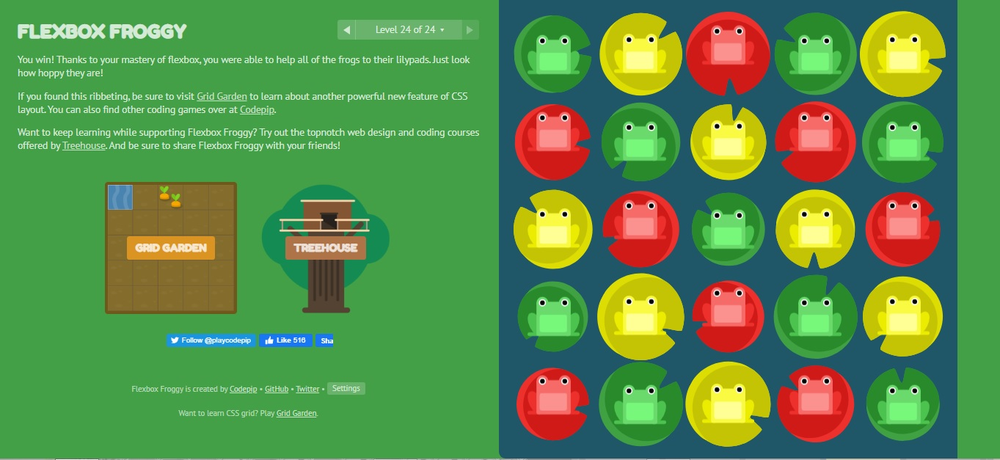 

Responsive Web Design Fundamentals (<b>screenshots</b>)

  
  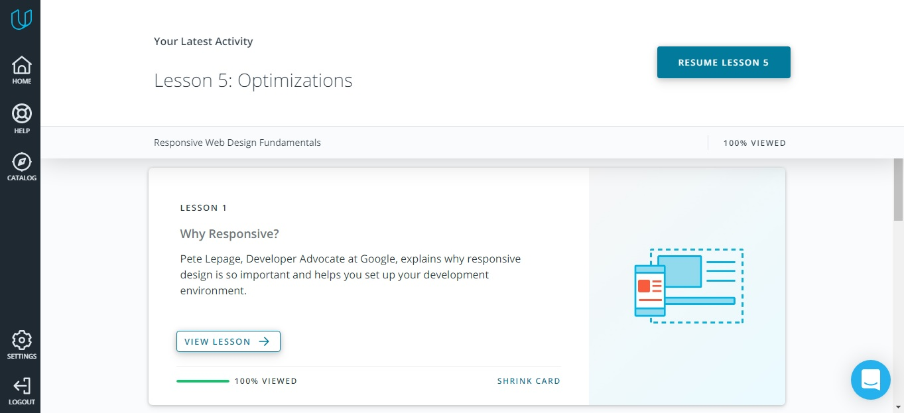  
  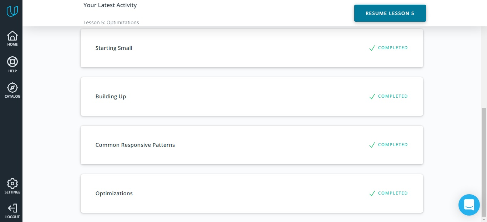  

## <a name="popup">HTML & CSS practice: Hooli-style Popup</a>
It was an interesting task, I had not yet faced such a task. I was pleased that many different SCC properties had to be used in this task. A very interesting use of a checkbox.

**Practical task:**

Hooli-style Popup (<b>screenshot</b>)

  
  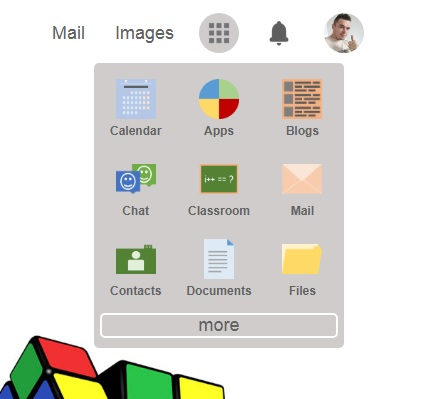 

>[Demo](https://ik-web.github.io/html-css-popup/) | [Code-base](https://github.com/ik-web/html-css-popup)

## <a name="js-basics">JavaScript Basics</a>
This topic was not easy for me. The material on [Udacity](https://classroom.udacity.com/courses/ud803) was useful, but I liked [freeCodeCamp](https://www.freecodecamp.org/learn/) better, there are many practical exercises. 
Most liked the sections:
- [Functional Programming](https://www.freecodecamp.org/learn/javascript-algorithms-and-data-structures/functional-programming/)
- [Basic Algorithm Scripting](https://www.freecodecamp.org/learn/javascript-algorithms-and-data-structures/basic-algorithm-scripting/)
- [Intermediate Algorithm Scripting](https://www.freecodecamp.org/learn/javascript-algorithms-and-data-structures/intermediate-algorithm-scripting/)

Intro to JS (<b>screenshots</b>)

  
  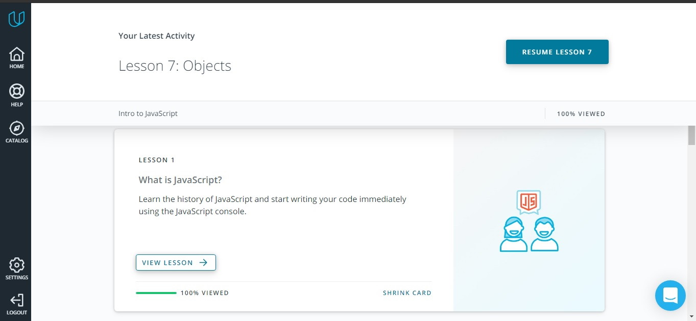  
  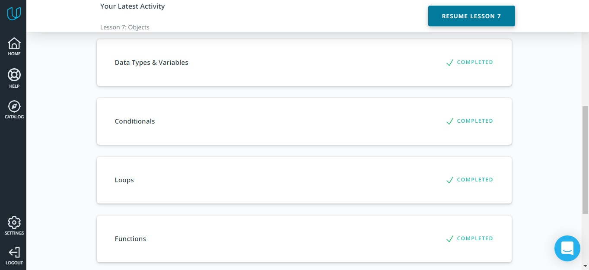  
  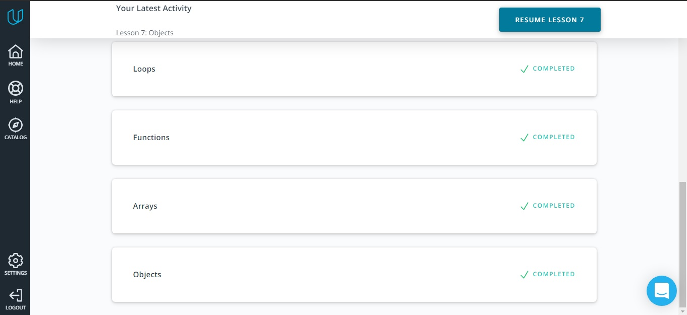 

JS on freeCodeCamp (<b>screenshots</b>)

  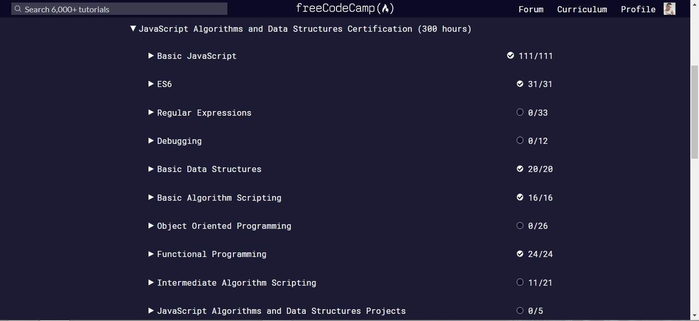  
  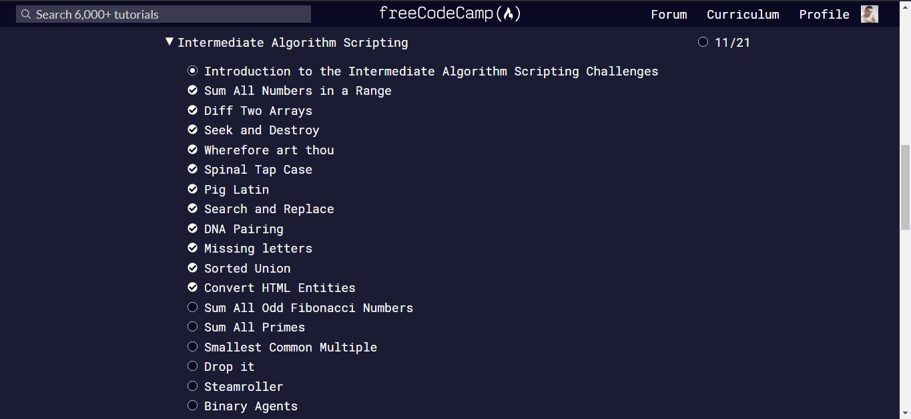 

## <a name="dom">DOM</a>
This was a very interesting topic. I learned a lot of new information. I made myself some notes on this topic, because it is impossible to remember everything in a short time. But now that I have an understanding of the [DOM](https://classroom.udacity.com/courses/ud117) in Javascript, I can easily brush up on my knowledge by referring to the [MDN](https://developer.mozilla.org/en-US/) documentation or another resource.

JavaScript and the DOM (<b>screenshots</b>)

  
  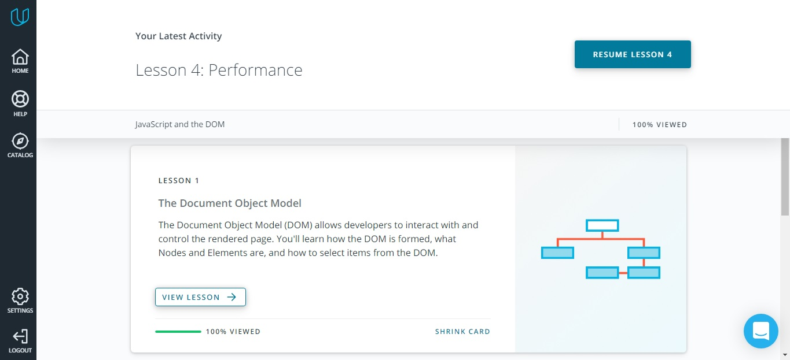  
  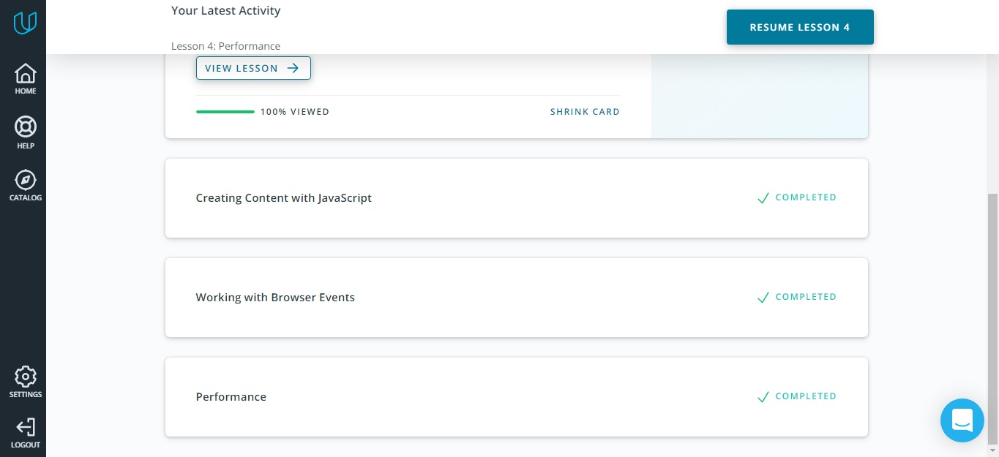 

freecodecamp Algorithm Scripting Challenges (<b>screenshot</b>)

  
  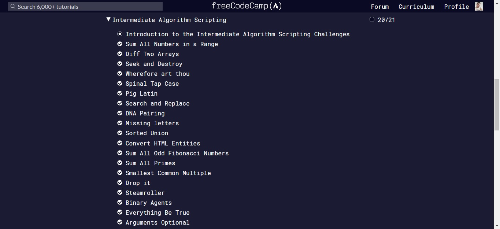  

**Practical task:**

It was a very interesting practical task for me. I am also very grateful to the mentor who reviewed my work, as this person helped me a lot to understand this topic in more detail.

Practical work (using DOM) (<b>screenshot</b>)

  
  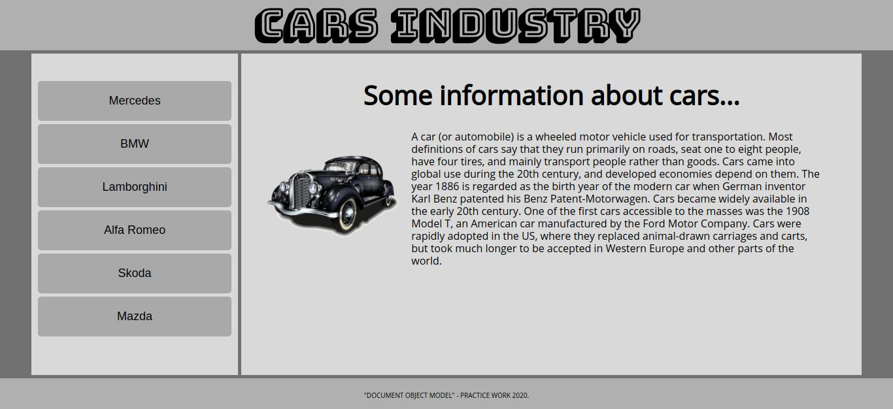  

>[Demo](https://ik-web.github.io/js-dom/) | [Code-base](https://github.com/ik-web/js-dom)

## <a name="pre-oop">Building a Tiny JS World (pre-OOP)</a>
[This task](https://github.com/ik-web/a-tiny-JS-world) wasn't difficult, but it is also an experience. Attached to this topic is material on [Copying Objects in JavaScript](https://www.digitalocean.com/community/tutorials/copying-objects-in-javascript) - this is also useful information for me.

**Practical task:**
>[A Tiny JS World](https://ik-web.github.io/a-tiny-JS-world/)

## <a name="oop">Object Oriented JS</a>
The topic is still quite difficult for me, but thanks to [this course](https://classroom.udacity.com/courses/ud015) I got to know it better, learned a lot, my interest in javascript has grown even more))

Udacity Object Oriented JS (<b>screenshots</b>)

  
  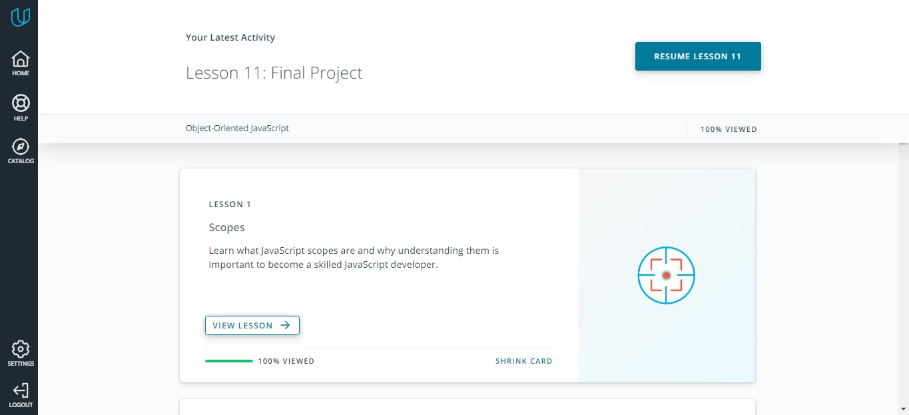  
  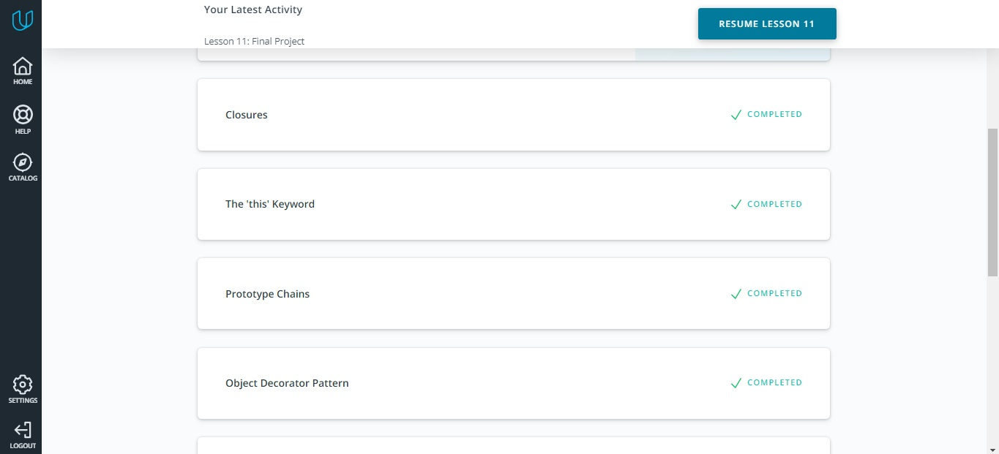  
    
   

Codewars (<b>screenshot</b>)

  
  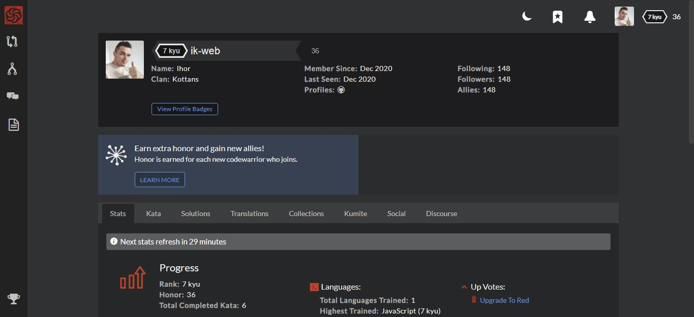 

**Practical task:**

Arcade Game - Frogger (<b>screenshot</b>)

  
  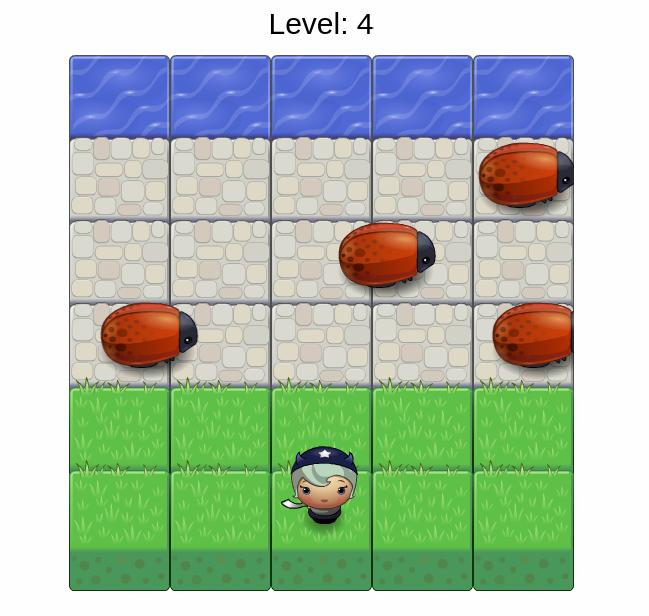 

>[Demo](https://ik-web.github.io/game-frogger/) | [Code-base](https://github.com/ik-web/game-frogger)

## <a name="post-oop">OOP exercise</a>
It was a good task. It's not big, but useful to me. I learned better how to work with javascript classes. When I learned the theory, everything seemed to understanding, but then some of what I learned flew out of my head. But after completing the practical task, the material took root better.

They also provided [useful materials on this topic](https://github.com/ik-web/a-tiny-JS-world#leveling-your-skills-up), for which I am very grateful to my mentors.

**Practical task:**
>[A Tiny JS World](https://ik-web.github.io/a-tiny-JS-world/) | [Code-base](https://github.com/ik-web/a-tiny-JS-world/blob/master/index.js)

## <a name="offline-web-app">Offline Web Applications</a>

## <a name="memory-pair-game">Memory - Pair Game</a>
That was a really interesting project. It wasn't simple for me but it helped me to understand  much better how javascript works.

**Practical task:**

Memory - Pair Game (<b>screenshot</b>)

  
  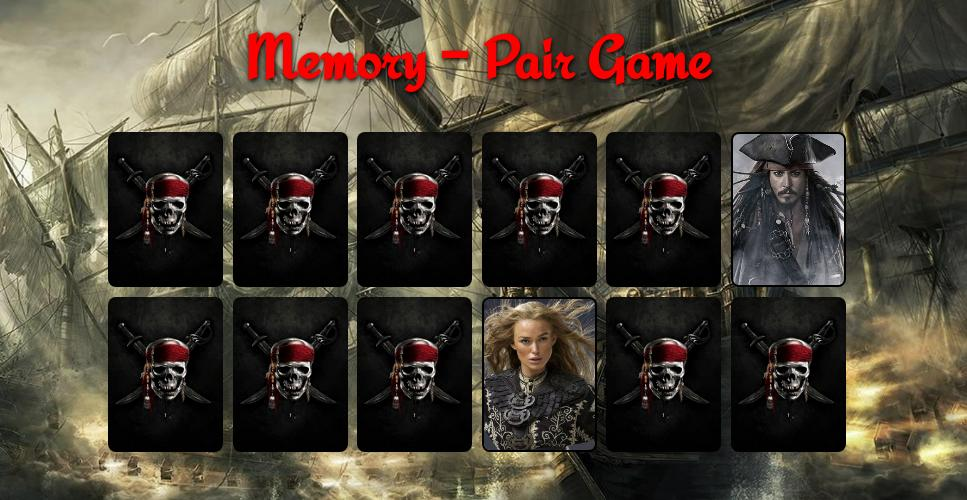 

[Demo](https://ik-web.github.io/memory-pair-game/) | [Code-base](https://github.com/ik-web/memory-pair-game)

## <a name="website-optimization">Website Performance Optimization</a>

## <a name="friends-app">Friends App</a>
It was a good educational project. It helped me better understand how to work with asynchronous javascript and I got more experience for working with forms and data filters. I want to thank my mentors for these materials. Thanks a lot!

**Practical task:**

Friends App (<b>screenshot</b>)

  
  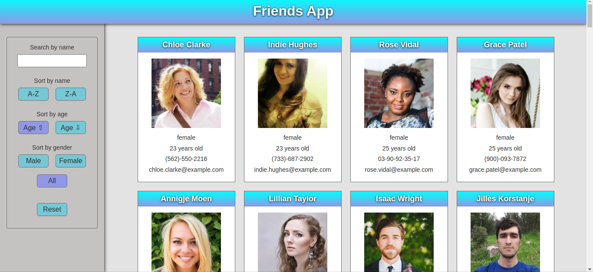 

[Demo](https://ik-web.github.io/friends-app/) | [Code-base](https://github.com/ik-web/friends-app)

## <a name="lecture-1">W3C and WHATWG Standards. HTML markup. CSS, Grids</a>
After watching a [lecture](https://www.youtube.com/watch?v=xogSwtgiEJ0&t=37s) on this topic, I repeated and consolidated my knowledge of the semantics of HTML better, I got the good advice on page layout. Refreshed knowledge on CSS, selector nuances, Tables, Float, Flex, Grid.

There is also provided useful links to resources such as:

- [The W3C Markup Validation Service](https://validator.w3.org/#validate_by_upload)
- [Can I include a tag to a tag? Based on HTML Spec WHATWG](https://caninclude.glitch.me/)
- [HTML tree generator](https://yoksel.github.io/html-tree/)
- [Words commonly used in CSS classes](https://github.com/yoksel/common-words/)
- [Awesome and unknown inline-block](https://css-live.ru/articles-css/udivitelnyj-i-neizvestnyj-inline-block.html)
- [When do you use inline-block? | CSS-Tricks](https://css-tricks.com/when-do-you-use-inline-block/)
- [A Complete Guide to Grid | CSS-Tricks](https://css-tricks.com/snippets/css/complete-guide-grid/)
- [CSS Grid Course! Welcome — 1 of 25 - YouTube](https://www.youtube.com/watch?v=T-slCsOrLcc&list=PLu8EoSxDXHP5CIFvt9-ze3IngcdAc2xKG&ab_channel=WesBos)
- [Web forms — Working with user data](https://developer.mozilla.org/en-US/docs/Learn/Forms) 

**Practical task:**

Movie seats booking (<b>screenshot</b>)

  
  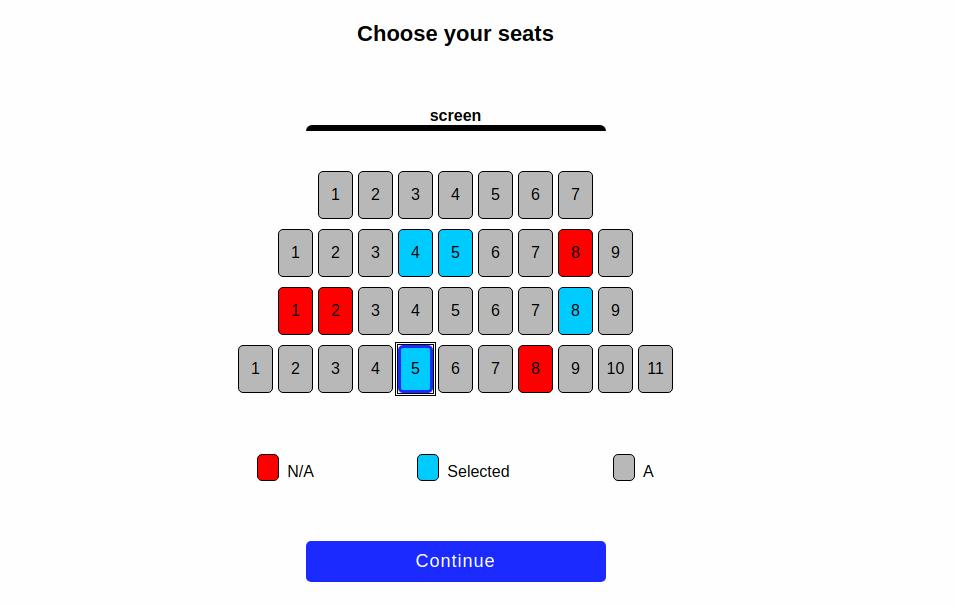 

>[Demo](https://ik-web.github.io/html-movie-seat-booking/) | [Code-base](https://github.com/ik-web/html-movie-seat-booking)

## <a name="lecture-2">Graphics, А11Y and forms, work with content</a>
I watched [a lecture on this topic](https://www.youtube.com/watch?v=7Q7jEa5h3FY). There was a lot of interesting and useful material.

I wrote some notes on the graphics:

- For decorative graphics it is better to use the `.svg` image format, for content graphics `.avif`.
- The attribute [srcset](https://developer.mozilla.org/en-US/docs/Web/API/HTMLImageElement/srcset) - a comma-separated list of one or more image candidate strings to be used when determining which image resource to present inside the `` element.
- The [<picture>](https://developer.mozilla.org/en-US/docs/Web/HTML/Element/picture) tag contains zero or more `<source>` elements and one `` element to offer alternative versions of an image for different display/device scenarios.
- The `` tag has an interesting attribute [loading](https://developer.mozilla.org/en-US/docs/Web/Performance/Lazy_loading) with a value `lazy`, but you need to be careful with it, it doesn't work well on large screens.
- To prevent the form from being submitted when the `<button>` is clicked, it is important to specify type = "button".

Useful links about accessibility:

- [W3C Accessibility Guidelines (WCAG) 3.0](https://www.w3.org/TR/wcag-3.0/)
- [WCAG 3 How-Tos | How-To | WCAG 3 | Web Accessibility Initiative (WAI) | W3C](https://www.w3.org/WAI/GL/WCAG3/2020/how-tos/)
- [tabindex - HTML: HyperText Markup Language | MDN](https://developer.mozilla.org/en-us/docs/Web/HTML/Global_attributes/tabindex)
- [How to help the blind on your site](https://weblind.ru/)
- [Inclusive Components](https://inclusive-components.design/)
- [Using ARIA](https://www.w3.org/TR/using-aria/#NOTES)
- [Using ARIA: Roles, states, and properties - Accessibility | MDN](https://developer.mozilla.org/en-us/docs/Web/Accessibility/ARIA/ARIA_Techniques)
- [WAI-ARIA Authoring Practices 1.2](https://w3c.github.io/aria-practices/)

About content (it was new for me):

- The [overflow-wrap](https://developer.mozilla.org/en-US/docs/Web/CSS/overflow-wrap) CSS property applies to inline elements, setting whether the browser should insert line breaks within an otherwise unbreakable string to prevent text from overflowing its line box.
- The [hyphens](https://developer.mozilla.org/en-US/docs/Web/CSS/hyphens) CSS property specifies how words should be hyphenated when text wraps across multiple lines.
- Text truncation with trailing ellipsis (oneline):
> `white-space: nowrap;` 
> `overflow: hidden;` 
> `text-overflow: ellipsis;`
- Text truncation with trailing ellipsis (multiple) !!!Don't work with IE!!!:
> `display: -webkit-box;` 
> `-webkit-line-clamp: 3;` 
> `-webkit-box-orient: vertical;` 
> `overflow: hidden;`

Othet useful materials of this topic:

- [Smashing Magazine — For Web Designers And Developers](https://www.smashingmagazine.com/)
- [A multidisciplinary designer with an eye for details.](https://ishadeed.com/)
- [CSS-Tricks](https://css-tricks.com/)
- [Digest of fresh materials from the frontend world](https://habr.com/ru/post/538972/)

## <a name="lecture-3">Introducing the Internet, how browser works, cookie</a>
I watched an interesting [lecture on this topic](https://www.youtube.com/watch?v=0l7ikOmdGGQ&t=3097s). I refreshed my knowledge, and also I got new ones:

- Difference between IPv4 and IPv6 
- To find the DNS note, the browser checks 4 caches (1.Browser cache; 2.OS cache; 3.Router cache; 4.provider cache). 
- TCP is used wherever accurate and verifiable data transmission is required - for example, to send photos or communicate between users. UDP, in turn, is required for communication in voice format or when transmitting streaming video, for example, from webcams or IP cameras. 
- I learned more about SSL/TLS 
- I learned more about cookies. Their advantages and disadvantages. 

Useful materials:

- [Networking for Web Developers - Udacity](https://www.udacity.com/course/networking-for-web-developers--ud256)
- [How HTTP works](https://howhttps.works/episodes/)
- [How DNS works](https://howdns.works/)
- [HTTP response status codes](https://developer.mozilla.org/en-US/docs/Web/HTTP/Status)
- [Kontra OWASP Top 10 for Web](https://application.security/free/owasp-top-10)
- [Roman Yakobchuk - A tale of one request. How Internet works under the hood](https://www.youtube.com/watch?app=desktop&v=uXXdYCd93F8&list=PLnkLrCUX4Qh4RH-BltBk03Eet1UAF-S7S&index=4)
- [SSL/TLS and HTTPS](https://www.hostinger.com.ua/rukovodstva/shto-takoe-ssl-tls-i-https/)

## <a name="lecture-4">DOM and Layout Trees</a>
I was in the lecture on the DOM ([part-1](https://www.youtube.com/watch?v=7xy--CqvcDk), [part-2](https://www.youtube.com/watch?v=sSLSp7uz3Mo&t=1478s)). It was interesting, I repeated and consolidated the material on this topic, which was very useful to me!

- I got a better understanding the [preventDefault](https://developer.mozilla.org/en-US/docs/Web/API/Event/preventDefault), [stopPropagation](https://developer.mozilla.org/en-US/docs/Web/API/Event/stopPropagation) and [stopImmediatePropagation](https://developer.mozilla.org/en-US/docs/Web/API/Event/stopImmediatePropagation) methods.
- I understood what is the difference between an [HTMLCollection](https://developer.mozilla.org/en-US/docs/Web/API/HTMLCollection) and a [NodeList](https://developer.mozilla.org/en-US/docs/Web/API/NodeList).

**Practical task:**

Movie seats booking (using DOM) (<b>screenshot</b>)

  
  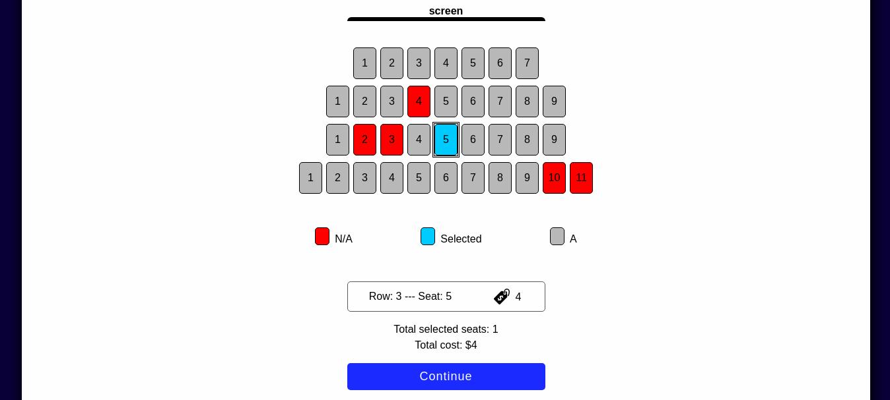 

>[Demo](https://ik-web.github.io/movie-seat-booking-js/) | [Code-base](https://github.com/ik-web/movie-seat-booking-js)

## <a name="lecture-5">Scope, Closure (YDKJS)</a>
I read the book ["You Don't Know Javascript - Scope & Closures"](https://github.com/getify/You-Dont-Know-JS/blob/1st-ed/scope%20&%20closures/README.md#you-dont-know-js-scope--closures). And also participated in the AMA session on this topic. I expanded my knowledge of closures and scopes. But I want to say that the book was difficult for me in understanding some points ... So I will definitely return to it and re-read it again.

Short useful videos on this topic:

- [Scope](https://www.youtube.com/watch?v=ft_8tuRj9CE&list=PLS8sEUxbfFY_eoMYj8tifTn83xv_VgnSd&index=6)
- [Execution context](https://www.youtube.com/watch?v=b52XdijI2ns&list=PLS8sEUxbfFY_eoMYj8tifTn83xv_VgnSd&index=7)
- [Hoisting](https://www.youtube.com/watch?v=0Vb_Sse3xak&list=PLS8sEUxbfFY_eoMYj8tifTn83xv_VgnSd&index=8)
- [Closure](https://www.youtube.com/watch?v=PIFGtdLgwi4&list=PLS8sEUxbfFY_eoMYj8tifTn83xv_VgnSd&index=9)

Useful materials:

- [Lecture 1 - Scope & Closures (YDKJS)](https://www.notion.so/1-9a83cb1f515a453982bb3cd20dcd33b0#1b26a89b249845bfbee5d1ea2fe1213a)
- [I never understood JavaScript closures](https://medium.com/dailyjs/i-never-understood-javascript-closures-9663703368e8)

Noted some points:

>
>
>
>
>

## <a name="lecture-6">Objects & this (YDKJS)</a>
Watched a great [lecture](https://www.youtube.com/watch?v=CuEErkIQP5c&list=PLS8sEUxbfFY_eoMYj8tifTn83xv_VgnSd&index=15) on this topic. I repeated the material, understood the descriptors better, and also familiarized myself with "this" in more detail. I read the book [You Don't Know JS: this & Object Prototypes](https://github.com/getify/You-Dont-Know-JS/blob/1st-ed/this%20&%20object%20prototypes/README.md#you-dont-know-js-this--object-prototypes) - chapter 1, 2, 3. That's a good book, many useful explanations, but like the previous part "Scope & Closures", the book was difficult for me, I will reread it.

Short useful videos on this topic:

- [Object props](https://www.youtube.com/watch?v=mIXdx7hSwIk&list=PLS8sEUxbfFY_eoMYj8tifTn83xv_VgnSd&index=11)
- [Property descriptors](https://www.youtube.com/watch?v=1CNa1_tfS5U&list=PLS8sEUxbfFY_eoMYj8tifTn83xv_VgnSd&index=12)
- [Object creation](https://www.youtube.com/watch?v=KJYW-TTrJxE&list=PLS8sEUxbfFY_eoMYj8tifTn83xv_VgnSd&index=13)
- 

Noted some points:

>
>
>
>
>

