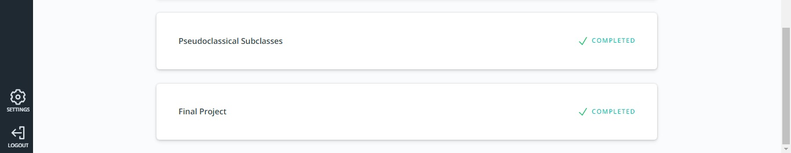

# kottans-frontend
#### My progress in kottans course:

**Stage 0**

- [1. Git Basics](#git)
- [2. Linux CLI, and HTTP](#linux_http)
- [3. Git Collaboration](#git_collaboration)
- [4. Intro to HTML and CSS](#html_scc)
- [5. Responsive Web Design](#responsive)
- [6. HTML & CSS Practice](#popup) 
- [7. JavaScript Basics](#js-basics)
- [8. DOM](#dom)
- [9. Building a Tiny JS World (pre-OOP)](#pre-oop)
- [10. Object Oriented JS](#oop)
- [11. OOP exercise](#post-oop)
- [12. Offline Web Applications](#offline-web-app)
- [13. Memory - Pair Game](#memory-pair-game)
- [14. Website Performance Optimization](#website-optimization)
- [15. Friends App](#friends-app)

## <a name="git">Git Basics</a>
I already knew a little about git. The [Udacity course](https://www.udacity.com/course/version-control-with-git--ud123) was very interesting, I learned about such commands as: `diff`, `reset`, `fetch`, `rebase`, `cherry-pick`. And the tasks in [learngitbranching.js.org](https://learngitbranching.js.org/) helped a lot to get into working with branches. I learned this topic with pleasure, but I will still come back to it to refresh my knowledge of git.

I keep to myself [Udacity Git Commit Message Style Guide](https://udacity.github.io/git-styleguide/).

Version Control with Git (<b>screenshots</b>)

  
    
    

Learngitbranching.js.org (<b>screenshots</b>)

  
    
    
   

## <a name="linux_http">Linux CLI, and HTTP</a>

### Linux CLI
I really liked [Linux Survival (4 modules)](https://linuxsurvival.com/). The information was interesting and easy to understand. 
To tell you the truth, To tell you the truth, I'm starting to love the command line and Linux OS. Unfortunately, my computer runs on Windows, but it seems to me that I'll switch to Linux in the near future. 
My knowledge in this area was small, but thanks to this course, it began to expand. 
I learned new commands for myself, such as: 
> - `chmod`  change file permission
> - `finger`  view information about users
> - `lpr, lpq, lprm`  Send to Printer to Print and / or Cancel
> - `grep`  search for a word in the text
> - `ps`  see running processes
> - `kill` kill running process
> - `kill -9`  kill immediately running process) 

Linux Survival (4 modules) (<b>screenshots</b>)

  
    
    
    
    

### HTTP
I also learned the HTTP protocol. Information on this topic isn't easy for me. 
I'll come back to this material later to repeat it. 
HTTP protocol: [part-1](https://code.tutsplus.com/tutorials/http-the-protocol-every-web-developer-must-know-part-1--net-31177), [part-2](https://code.tutsplus.com/tutorials/http-the-protocol-every-web-developer-must-know-part-2--net-31155). 

## <a name="git_collaboration">Git Collaboration</a> 
I liked [this topic](https://classroom.udacity.com/courses/ud456) of this course. I learned how collaborate in git with other developers. I also learned to create forks and pull requests. I figured out in more detail the `rebase` and `cherry-pick`. I also repeated what I already knew, which I also find very useful.

GitHub & Collaboration (<b>screenshots</b>)

  
   

Learngitbranching.js.org (<b>screenshots</b>)

  
    
    

## <a name="html_scc">Intro to HTML and CSS</a>
Before learning on this course, I already knew a little HTML and CSS, but after learning at [Udasity](https://www.udacity.com/course/intro-to-html-and-css--ud001) and [Codecademy](https://www.codecademy.com/catalog/language/html-css) I repeated the material, learned in more detail what I didn't understand, and I also learned new things for myself such as CSS Grid.

Intro to HTML & CSS (<b>screenshots</b>)

  
    
   

Learn HTML (<b>screenshots</b>)

  
    
    
   

Learn CSS (<b>screenshots</b>)

    
    
    
   

## <a name="responsive">Responsive Web Design</a>
I liked the [Responsive Web Design Fundamentals course](https://www.udacity.com/course/responsive-web-design-fundamentals--ud893) on Udacity. I think I'll come back to this material, repetition will be useful.  
I already knew a little about CSS Flexbox. I liked [Flexbox Froggy](http://flexboxfroggy.com/), it is easier to understand how CSS Flexbox works. When I played this game, I remembered properties like `align-content`, `flex-flow`, `row-reverse`, and `column-reverse`.

Flexbox Froggy (<b>screenshots</b>)

  
   

Responsive Web Design Fundamentals (<b>screenshots</b>)

  
    
    

HTML & CSS Practice

## <a name="popup">HTML & CSS practice: Hooli-style Popup</a>
It was an interesting task, I had not yet faced such a task. I was pleased that many different SCC properties had to be used in this task. A very interesting use of a checkbox.

Hooli-style Popup (<b>screenshots</b>)

  
   

>[Demo](https://ik-web.github.io/html-css-popup/)

## <a name="js-basics">JavaScript Basics</a>
This topic was not easy for me. The material on [Udacity](https://classroom.udacity.com/courses/ud803) was useful, but I liked [freeCodeCamp](https://www.freecodecamp.org/learn/) better, there are many practical exercises. 
Most liked the sections:
- [Functional Programming](https://www.freecodecamp.org/learn/javascript-algorithms-and-data-structures/functional-programming/)
- [Basic Algorithm Scripting](https://www.freecodecamp.org/learn/javascript-algorithms-and-data-structures/basic-algorithm-scripting/)
- [Intermediate Algorithm Scripting](https://www.freecodecamp.org/learn/javascript-algorithms-and-data-structures/intermediate-algorithm-scripting/)

Intro to JS (<b>screenshots</b>)

  
    
    
   

JS on freeCodeCamp (<b>screenshots</b>)

    
   

## <a name="dom">DOM</a>
This was a very interesting topic. I learned a lot of new information. I made myself some notes on this topic, because it is impossible to remember everything in a short time. But now that I have an understanding of the [DOM](https://classroom.udacity.com/courses/ud117) in Javascript, I can easily brush up on my knowledge by referring to the [MDN](https://developer.mozilla.org/en-US/) documentation or another resource.

JavaScript and the DOM (<b>screenshots</b>)

  
    
   

freecodecamp Algorithm Scripting Challenges (<b>screenshots</b>)

  
    

**Practical task:** 
It was a very interesting practical task for me. I am also very grateful to the mentor who reviewed my work, as this person helped me a lot to understand this topic in more detail. 
>[Demo](https://ik-web.github.io/js-dom/)

## <a name="pre-oop">Building a Tiny JS World (pre-OOP)</a>
[This task](https://github.com/ik-web/a-tiny-JS-world) wasn't difficult, but it is also an experience. Attached to this topic is material on [Copying Objects in JavaScript](https://www.digitalocean.com/community/tutorials/copying-objects-in-javascript) - this is also useful information for me.

**Practical task:**
>[A Tiny JS World](https://ik-web.github.io/a-tiny-JS-world/)

## <a name="oop">Object Oriented JS</a>
The topic is still quite difficult for me, but thanks to [this course](https://classroom.udacity.com/courses/ud015) I got to know it better, learned a lot, my interest in javascript has grown even more))

Udacity Object Oriented JS (<b>screenshots</b>)

  
    
    
    
   

Codewars (<b>screenshots</b>)

  
   

**Practical task:** 
 

>[Demo](https://ik-web.github.io/game-frogger/) | [Code-base](https://github.com/ik-web/game-frogger)

## <a name="post-oop">OOP exercise</a>

## <a name="offline-web-app">Offline Web Applications</a>

## <a name="memory-pair-game">Memory - Pair Game</a>
That was a really interesting project. It wasn't simple for me but it helped me to understand  much better how javascript works.

Memory - Pair Game (<b>screenshots</b>)

  
   

[Demo](https://ik-web.github.io/memory-pair-game/) | [Code-base](https://github.com/ik-web/memory-pair-game)

## <a name="website-optimization">Website Performance Optimization</a>

## <a name="friends-app">Friends App</a>
It was a good educational project. It helped me better understand how to work with asynchronous javascript and I got more experience for working with forms and data filters. I want to thank my mentors for these materials. Thanks a lot!

Friends App (<b>screenshots</b>)

  
   

[Demo](https://ik-web.github.io/friends-app/) | [Code-base](https://github.com/ik-web/friends-app)
